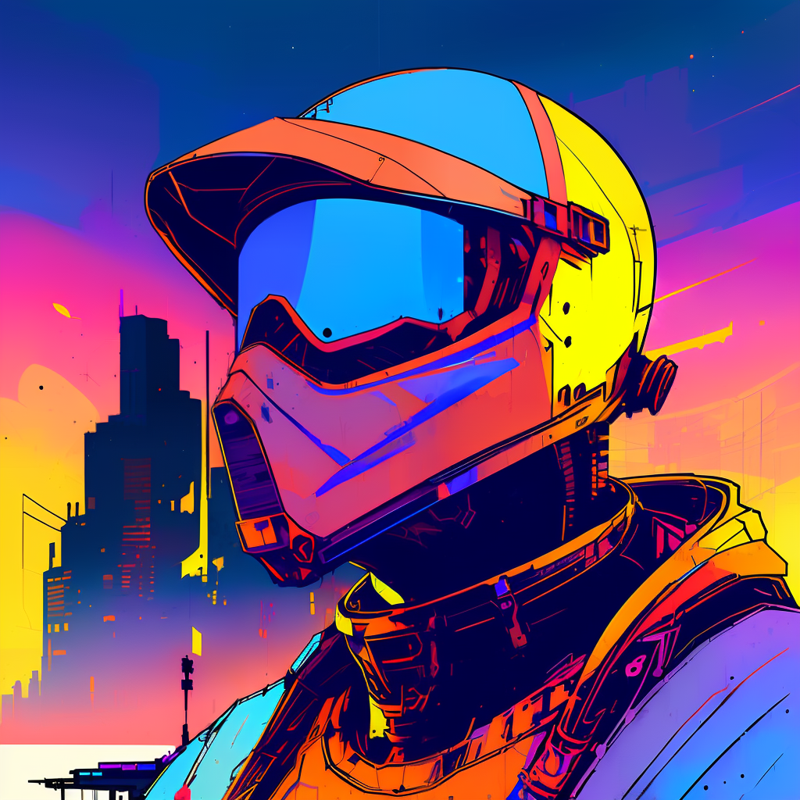

<h1 align="center">Hi there 👋🤖🎨</h1>

Check this out...

    
     
    

<!-- First image was created using text2img with Stable Diffusion v1.4. Final result was created using a mix of img2img loopback from the initial image and inpainting to fix details and create new backgrounds. I used SD v1.5 with [Automatic1111's Stable Diffusion web UI](https://github.com/AUTOMATIC1111/stable-diffusion-webui), specifically [Inkpunk Diffusion](https://huggingface.co/Envvi/Inkpunk-Diffusion) to get the style. -->

    The first image was created using text2img with Stable Diffusion v1.4. Final result was created using a mix of img2img loopback from the initial image and inpainting to fix details and create new backgrounds. That was done on SD v1.5, specifically <a href="https://huggingface.co/Envvi/Inkpunk-Diffusion">Inkpunk Diffusion</a> to get the style. All images were made using <a href="https://github.com/AUTOMATIC1111/stable-diffusion-webui">Automatic1111's Stable Diffusion web UI</a>.

<!--
**faris-k/faris-k** is a ✨ _special_ ✨ repository because its `README.md` (this file) appears on your GitHub profile.

Here are some ideas to get you started:

- 🔭 I’m currently working on ...
- 🌱 I’m currently learning ...
- 👯 I’m looking to collaborate on ...
- 🤔 I’m looking for help with ...
- 💬 Ask me about ...
- 📫 How to reach me: ...
- 😄 Pronouns: ...
- ⚡ Fun fact: ...
-->
